Relatório de Análise e Projeção de Séries Temporais
========================================================


```
## This is forecast 4.06
## 
## locfit 1.5-9.1 2013-03-22 This is mgcv 1.7-22. For overview type
## 'help("mgcv-package")'.
```


Este relário tem como objecto de análise 


Dados originais:
-------------------------


```
##         Jan    Feb    Mar    Apr    May    Jun    Jul    Aug    Sep    Oct
## 2010 0.0450 0.0795 0.0609 0.0513 0.0619 0.0673 0.0715 0.0719 0.0520 0.0591
## 2011 0.0950 0.0914 0.0809 0.0469 0.0652 0.0553 0.0555 0.0687 0.0544 0.0637
## 2012 0.0447 0.0520 0.0507 0.0444 0.0521 0.0713 0.0679 0.0394 0.0690 0.0602
## 2013 0.0334 0.0660 0.0368 0.0564 0.0725 0.0576 0.0726 0.0485              
##         Nov    Dec
## 2010 0.1181 0.0801
## 2011 0.0518 0.0572
## 2012 0.0658 0.0552
## 2013
```


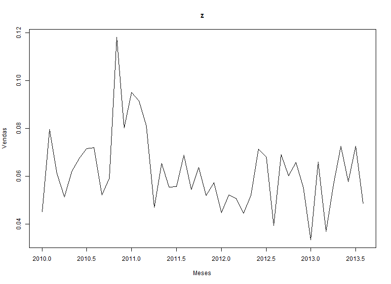 


```
## Warning: p-value smaller than printed p-value Warning: p-value smaller
## than printed p-value Warning: p-value smaller than printed p-value
```

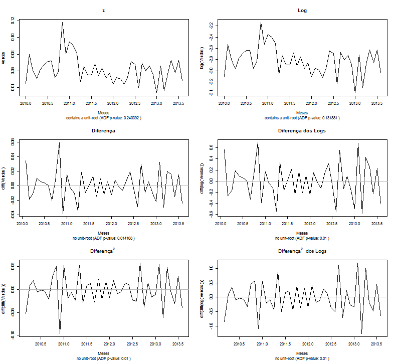 


Análise de Sazonalidade
-------------------------
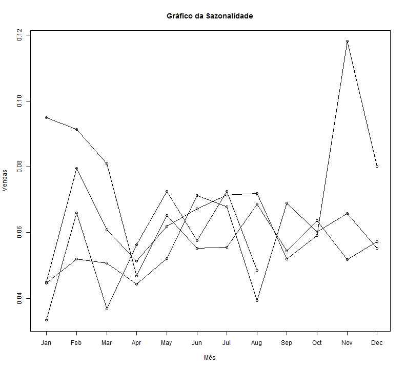 


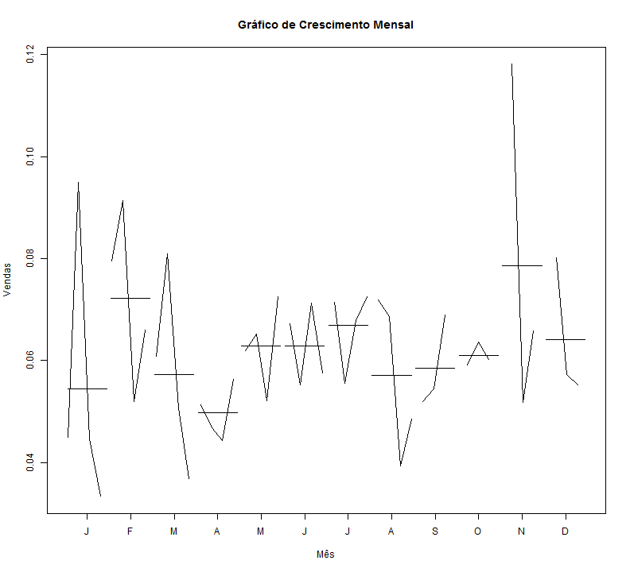 


### Sazonalidade - Autocorrelação
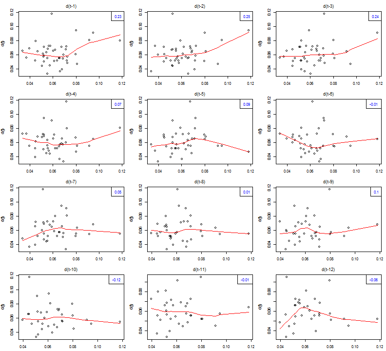 


### Seasonal Decomposition of Time Series by Loess


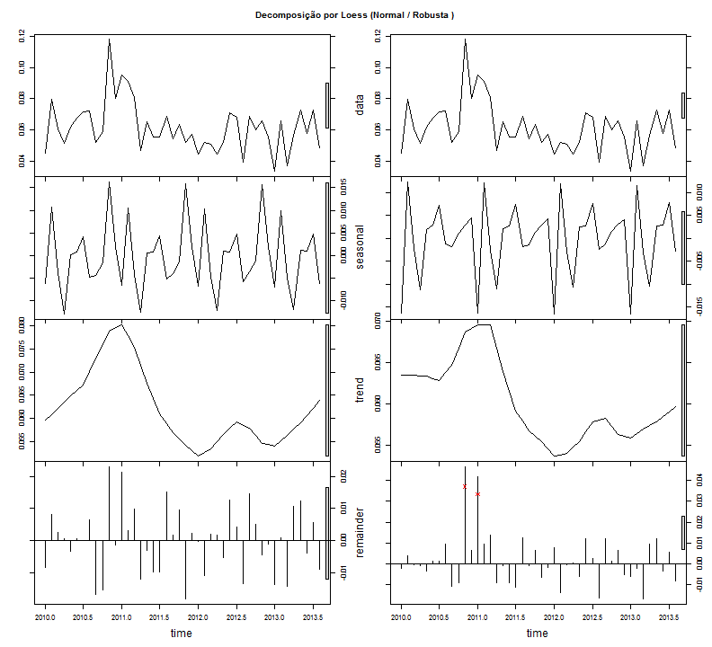 


Outros testes
-------------------------

### McLeod-Li test for conditional heteroscedascity (ARCH)
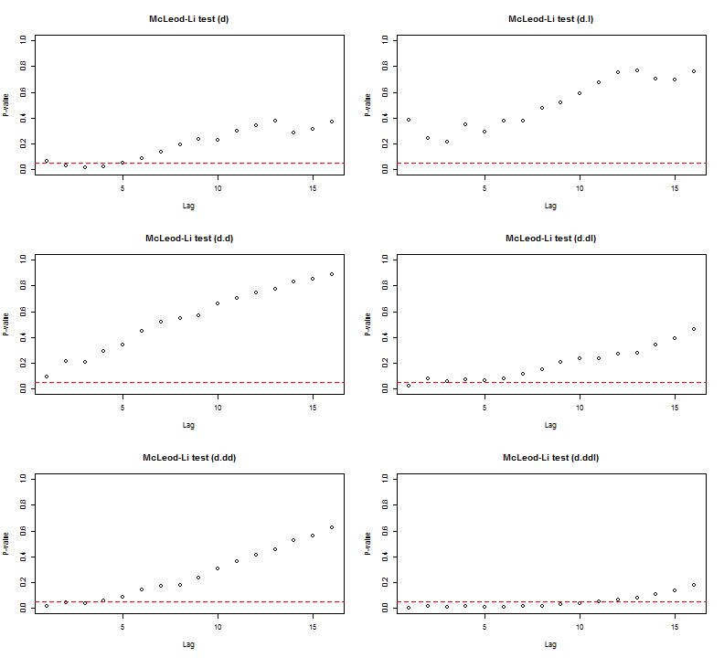 


Projeções
-------------------------


### Space-State Model (ETS)

```
## ETS(M,N,N) 
## 
## Call:
##  ets(y = d) 
## 
##   Smoothing parameters:
##     alpha = 0.2005 
## 
##   Initial states:
##     l = 0.0644 
## 
##   sigma:  0.2476
## 
##    AIC   AICc    BIC 
## -196.8 -196.5 -193.2 
## 
## Training set error measures:
##                      ME    RMSE     MAE   MPE  MAPE   MASE    ACF1
## Training set -0.0007422 0.01553 0.01189 -6.75 20.57 0.7001 0.07934
```

```
## 
## Forecast method: ETS(M,N,N)
## 
## Model Information:
## ETS(M,N,N) 
## 
## Call:
##  ets(y = d) 
## 
##   Smoothing parameters:
##     alpha = 0.2005 
## 
##   Initial states:
##     l = 0.0644 
## 
##   sigma:  0.2476
## 
##    AIC   AICc    BIC 
## -196.8 -196.5 -193.2 
## 
## Error measures:
##                      ME    RMSE     MAE   MPE  MAPE   MASE    ACF1
## Training set -0.0007422 0.01553 0.01189 -6.75 20.57 0.7001 0.07934
## 
## Forecasts:
##          Point Forecast   Lo 80   Hi 80    Lo 95   Hi 95
## Sep 2013        0.05788 0.03952 0.07625 0.029793 0.08597
## Oct 2013        0.05788 0.03913 0.07664 0.029200 0.08657
## Nov 2013        0.05788 0.03875 0.07702 0.028618 0.08715
## Dec 2013        0.05788 0.03837 0.07739 0.028045 0.08772
## Jan 2014        0.05788 0.03801 0.07776 0.027482 0.08828
## Feb 2014        0.05788 0.03764 0.07812 0.026928 0.08884
## Mar 2014        0.05788 0.03729 0.07848 0.026383 0.08938
## Apr 2014        0.05788 0.03693 0.07883 0.025845 0.08992
## May 2014        0.05788 0.03659 0.07918 0.025315 0.09045
## Jun 2014        0.05788 0.03625 0.07952 0.024792 0.09097
## Jul 2014        0.05788 0.03591 0.07986 0.024276 0.09149
## Aug 2014        0.05788 0.03558 0.08019 0.023766 0.09200
## Sep 2014        0.05788 0.03525 0.08052 0.023263 0.09250
## Oct 2014        0.05788 0.03492 0.08084 0.022766 0.09300
## Nov 2014        0.05788 0.03460 0.08117 0.022274 0.09349
## Dec 2014        0.05788 0.03428 0.08148 0.021788 0.09398
## Jan 2015        0.05788 0.03397 0.08180 0.021307 0.09446
## Feb 2015        0.05788 0.03366 0.08211 0.020832 0.09493
## Mar 2015        0.05788 0.03335 0.08242 0.020361 0.09540
## Apr 2015        0.05788 0.03304 0.08272 0.019895 0.09587
## May 2015        0.05788 0.03274 0.08302 0.019433 0.09633
## Jun 2015        0.05788 0.03244 0.08332 0.018976 0.09679
## Jul 2015        0.05788 0.03215 0.08362 0.018523 0.09724
## Aug 2015        0.05788 0.03185 0.08391 0.018074 0.09769
## Sep 2015        0.05788 0.03156 0.08420 0.017629 0.09814
## Oct 2015        0.05788 0.03127 0.08449 0.017188 0.09858
## Nov 2015        0.05788 0.03099 0.08478 0.016751 0.09902
## Dec 2015        0.05788 0.03070 0.08506 0.016317 0.09945
## Jan 2016        0.05788 0.03042 0.08534 0.015886 0.09988
## Feb 2016        0.05788 0.03014 0.08562 0.015459 0.10031
## Mar 2016        0.05788 0.02987 0.08590 0.015035 0.10073
## Apr 2016        0.05788 0.02959 0.08617 0.014614 0.10115
## May 2016        0.05788 0.02932 0.08645 0.014196 0.10157
## Jun 2016        0.05788 0.02905 0.08672 0.013781 0.10198
## Jul 2016        0.05788 0.02878 0.08699 0.013369 0.10240
## Aug 2016        0.05788 0.02851 0.08726 0.012960 0.10281
## Sep 2016        0.05788 0.02824 0.08752 0.012553 0.10321
## Oct 2016        0.05788 0.02798 0.08779 0.012149 0.10362
## Nov 2016        0.05788 0.02772 0.08805 0.011748 0.10402
## Dec 2016        0.05788 0.02746 0.08831 0.011349 0.10442
## Jan 2017        0.05788 0.02720 0.08857 0.010952 0.10481
## Feb 2017        0.05788 0.02694 0.08883 0.010558 0.10521
## Mar 2017        0.05788 0.02668 0.08908 0.010166 0.10560
## Apr 2017        0.05788 0.02643 0.08934 0.009777 0.10599
## May 2017        0.05788 0.02617 0.08959 0.009389 0.10638
## Jun 2017        0.05788 0.02592 0.08984 0.009004 0.10676
## Jul 2017        0.05788 0.02567 0.09009 0.008621 0.10714
## Aug 2017        0.05788 0.02542 0.09034 0.008239 0.10753
## Sep 2017        0.05788 0.02517 0.09059 0.007860 0.10791
## Oct 2017        0.05788 0.02493 0.09084 0.007483 0.10828
## Nov 2017        0.05788 0.02468 0.09108 0.007107 0.10866
## Dec 2017        0.05788 0.02444 0.09133 0.006734 0.10903
```


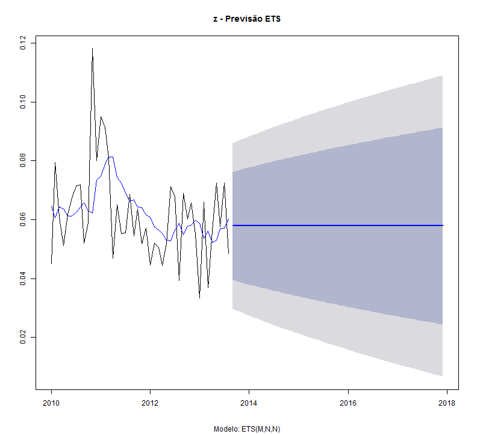 


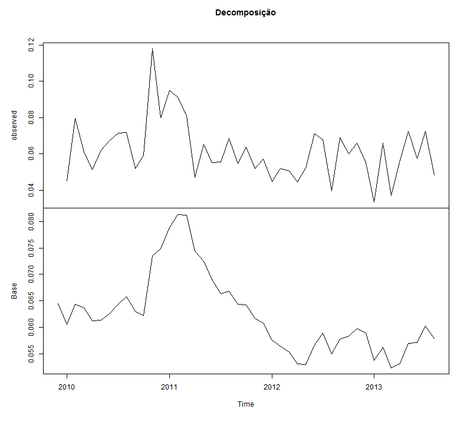 


### Arima - Pré análise


### Arima - Autocorrelation 
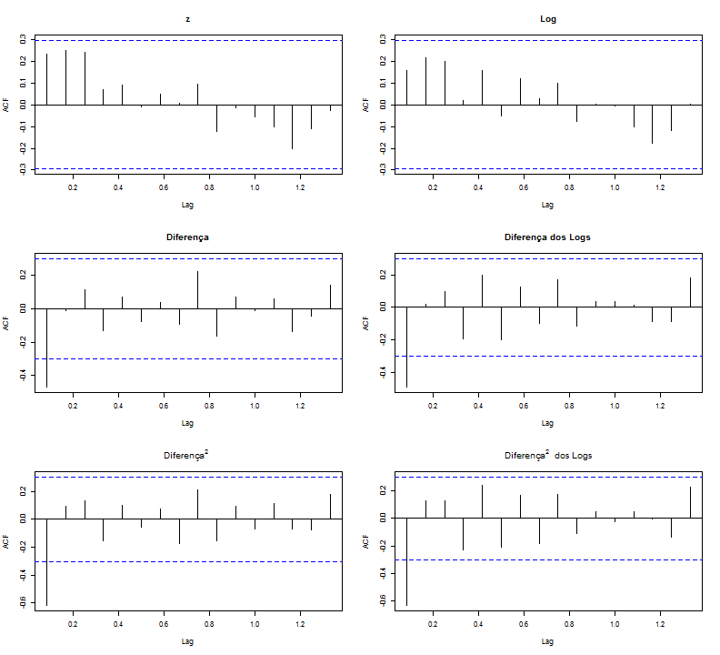 


### Arima - Partial Autocorrelation
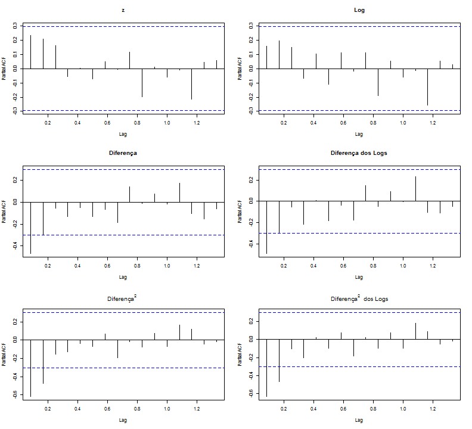 


### Arima - Projeção

```
## Warning: p-value greater than printed p-value
```

```
## 
##  ARIMA(2,0,2)(1,1,1)[12] with drift         : 1e+20
##  ARIMA(0,0,0)(0,1,0)[12] with drift         : -147.6
##  ARIMA(1,0,0)(1,1,0)[12] with drift         : -151.2
##  ARIMA(0,0,1)(0,1,1)[12] with drift         : 1e+20
##  ARIMA(1,0,0)(0,1,0)[12] with drift         : -148.1
##  ARIMA(1,0,0)(1,1,1)[12] with drift         : 1e+20
##  ARIMA(0,0,0)(1,1,0)[12] with drift         : -152.3
##  ARIMA(0,0,1)(1,1,0)[12] with drift         : -150.6
##  ARIMA(1,0,1)(1,1,0)[12] with drift         : -149.7
##  ARIMA(0,0,0)(1,1,0)[12]                    : -151
##  ARIMA(0,0,0)(1,1,1)[12] with drift         : 1e+20
## 
##  Best model: ARIMA(0,0,0)(1,1,0)[12] with drift
```

```
## 
## Forecast method: ARIMA(0,0,0)(1,1,0)[12] with drift        
## 
## Model Information:
## Series: d 
## ARIMA(0,0,0)(1,1,0)[12] with drift         
## 
## Coefficients:
##         sar1  drift
##       -0.528      0
## s.e.   0.162      0
## 
## sigma^2 estimated as 0.000359:  log likelihood=79.56
## AIC=-153.1   AICc=-152.3   BIC=-148.7
## 
## Error measures:
##                     ME    RMSE     MAE    MPE  MAPE   MASE   ACF1
## Training set 0.0002984 0.01615 0.01067 -3.684 18.93 0.6285 0.2054
## 
## Forecasts:
##          Point Forecast      Lo 80   Hi 80      Lo 95   Hi 95
## Sep 2013        0.05299  0.0287247 0.07726  0.0158770 0.09011
## Oct 2013        0.05375  0.0294836 0.07802  0.0166359 0.09087
## Nov 2013        0.05011  0.0258415 0.07438  0.0129938 0.08723
## Dec 2013        0.04796  0.0236915 0.07223  0.0108438 0.08508
## Jan 2014        0.03107  0.0068030 0.05534 -0.0060447 0.06819
## Feb 2014        0.05031  0.0260415 0.07458  0.0131938 0.08743
## Mar 2014        0.03585  0.0115761 0.06012 -0.0012716 0.07296
## Apr 2014        0.04177  0.0174978 0.06604  0.0046501 0.07889
## May 2014        0.05343  0.0291616 0.07770  0.0163139 0.09055
## Jun 2014        0.05654  0.0322705 0.08081  0.0194228 0.09366
## Jul 2014        0.06182  0.0375531 0.08609  0.0247054 0.09894
## Aug 2014        0.03540  0.0111293 0.05967 -0.0017184 0.07252
## Sep 2014        0.05315  0.0263162 0.07999  0.0121099 0.09420
## Oct 2014        0.04886  0.0220268 0.07570  0.0078206 0.08991
## Nov 2014        0.05010  0.0232657 0.07694  0.0090594 0.09114
## Dec 2014        0.04349  0.0166530 0.07033  0.0024468 0.08453
## Jan 2015        0.02401 -0.0028293 0.05084 -0.0170356 0.06505
## Feb 2015        0.05030  0.0234657 0.07714  0.0092594 0.09134
## Mar 2015        0.02805  0.0012186 0.05489 -0.0129877 0.06910
## Apr 2015        0.04120  0.0143641 0.06804  0.0001578 0.08224
## May 2015        0.05521  0.0283707 0.08204  0.0141645 0.09625
## Jun 2015        0.04881  0.0219688 0.07564  0.0077625 0.08985
## Jul 2015        0.05922  0.0323833 0.08606  0.0181771 0.10026
## Aug 2015        0.03402  0.0071868 0.06086 -0.0070195 0.07507
## Sep 2015        0.04477  0.0123363 0.07721 -0.0048352 0.09438
## Oct 2015        0.04315  0.0107131 0.07559 -0.0064584 0.09276
## Nov 2015        0.04181  0.0093742 0.07425 -0.0077973 0.09142
## Dec 2015        0.03756  0.0051183 0.06999 -0.0120532 0.08717
## Jan 2016        0.01944 -0.0129941 0.05188 -0.0301657 0.06905
## Feb 2016        0.04201  0.0095742 0.07445 -0.0075973 0.09162
## Mar 2016        0.02387 -0.0085632 0.05631 -0.0257348 0.07348
## Apr 2016        0.03321  0.0007672 0.06564 -0.0164043 0.08281
## May 2016        0.04597  0.0135366 0.07841 -0.0036350 0.09558
## Jun 2016        0.04460  0.0121575 0.07703 -0.0050141 0.09420
## Jul 2016        0.05230  0.0198617 0.08474  0.0026902 0.10191
## Aug 2016        0.02645 -0.0059829 0.05889 -0.0231544 0.07606
## Sep 2016        0.04090  0.0053127 0.07650 -0.0135282 0.09534
## Oct 2016        0.03787  0.0022815 0.07346 -0.0165594 0.09230
## Nov 2016        0.03790  0.0023040 0.07349 -0.0165369 0.09233
## Dec 2016        0.03239 -0.0031966 0.06799 -0.0220375 0.08683
## Jan 2017        0.01356 -0.0220325 0.04915 -0.0408734 0.06799
## Feb 2017        0.03810  0.0025040 0.07369 -0.0163369 0.09253
## Mar 2017        0.01779 -0.0178039 0.05338 -0.0366447 0.07222
## Apr 2017        0.02913 -0.0064586 0.06472 -0.0252995 0.08356
## May 2017        0.04256  0.0069642 0.07815 -0.0118767 0.09699
## Jun 2017        0.03852  0.0029324 0.07411 -0.0159085 0.09296
## Jul 2017        0.04766  0.0120680 0.08325 -0.0067729 0.10209
## Aug 2017        0.02216 -0.0134343 0.05775 -0.0322752 0.07659
## Sep 2017        0.03465 -0.0045915 0.07390 -0.0253663 0.09467
## Oct 2017        0.03237 -0.0068792 0.07161 -0.0276540 0.09238
## Nov 2017        0.03167 -0.0075757 0.07091 -0.0283505 0.09169
## Dec 2017        0.02683 -0.0124189 0.06607 -0.0331937 0.08685
```


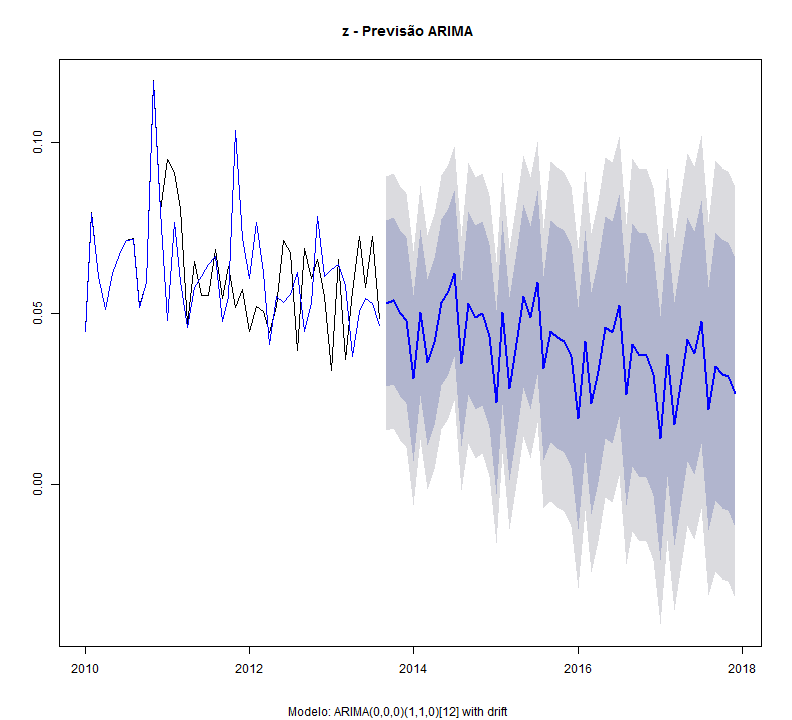 


### Linear Model 


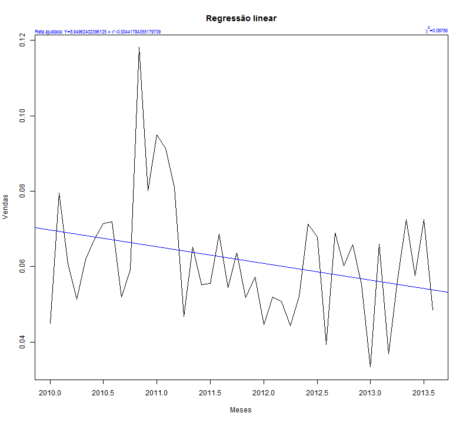 


```
## 
## Call:
## lm(formula = d ~ time(d))
## 
## Residuals:
##      Min       1Q   Median       3Q      Max 
## -0.02476 -0.00879 -0.00115  0.00936  0.05202 
## 
## Coefficients:
##             Estimate Std. Error t value Pr(>|t|)  
## (Intercept)  8.94962    4.42703    2.02    0.050 *
## time(d)     -0.00442    0.00220   -2.01    0.051 .
## ---
## Signif. codes:  0 '***' 0.001 '**' 0.01 '*' 0.05 '.' 0.1 ' ' 1
## 
## Residual standard error: 0.0154 on 42 degrees of freedom
## Multiple R-squared:  0.0876,	Adjusted R-squared:  0.0658 
## F-statistic: 4.03 on 1 and 42 DF,  p-value: 0.0511
```


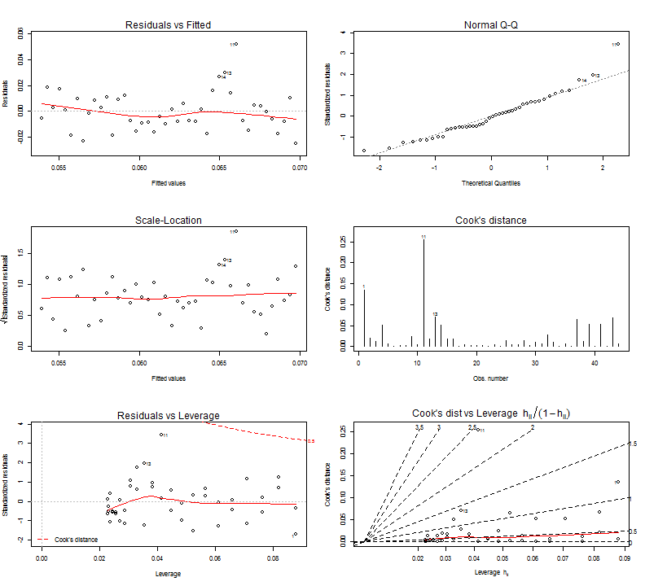 


```
## Analysis of Variance Table
## 
## Response: d
##           Df  Sum Sq  Mean Sq F value Pr(>F)  
## time(d)    1 0.00096 0.000962    4.03  0.051 .
## Residuals 42 0.01002 0.000239                 
## ---
## Signif. codes:  0 '***' 0.001 '**' 0.01 '*' 0.05 '.' 0.1 ' ' 1
```


### Trend - Seazonal Linear Model 
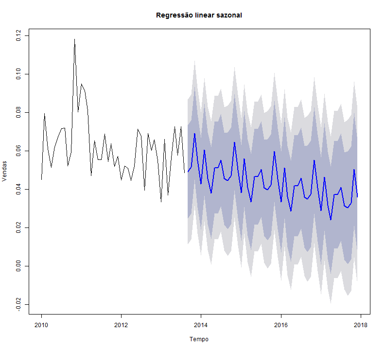 


```
## 
## Call:
## lm(formula = formula, data = "d", na.action = na.exclude)
## 
## Residuals:
##      Min       1Q   Median       3Q      Max 
## -0.02677 -0.00807 -0.00281  0.00810  0.03813 
## 
## Coefficients:
##              Estimate Std. Error t value Pr(>|t|)    
## (Intercept)  0.061965   0.008562    7.24  3.9e-08 ***
## trend       -0.000392   0.000187   -2.09    0.045 *  
## season2      0.018092   0.011015    1.64    0.111    
## season3      0.003583   0.011019    0.33    0.747    
## season4     -0.003600   0.011027   -0.33    0.746    
## season5      0.009966   0.011038    0.90    0.374    
## season6      0.010308   0.011053    0.93    0.358    
## season7      0.014699   0.011070    1.33    0.194    
## season8      0.005341   0.011091    0.48    0.633    
## season9      0.004725   0.011901    0.40    0.694    
## season10     0.007650   0.011909    0.64    0.525    
## season11     0.025608   0.011919    2.15    0.040 *  
## season12     0.011600   0.011932    0.97    0.339    
## ---
## Signif. codes:  0 '***' 0.001 '**' 0.01 '*' 0.05 '.' 0.1 ' ' 1
## 
## Residual standard error: 0.0156 on 31 degrees of freedom
## Multiple R-squared:  0.315,	Adjusted R-squared:  0.0502 
## F-statistic: 1.19 on 12 and 31 DF,  p-value: 0.333
```


```
## Analysis of Variance Table
## 
## Response: d
##           Df  Sum Sq  Mean Sq F value Pr(>F)  
## trend      1 0.00096 0.000962    3.96  0.055 .
## season    11 0.00250 0.000227    0.94  0.519  
## Residuals 31 0.00752 0.000243                 
## ---
## Signif. codes:  0 '***' 0.001 '**' 0.01 '*' 0.05 '.' 0.1 ' ' 1
```


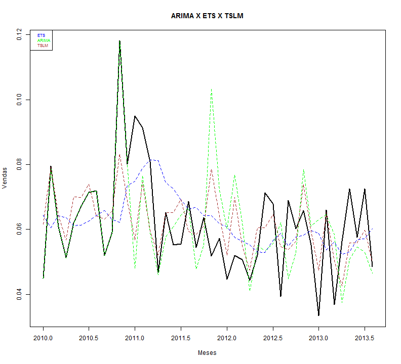 


### Comparação de Modelos
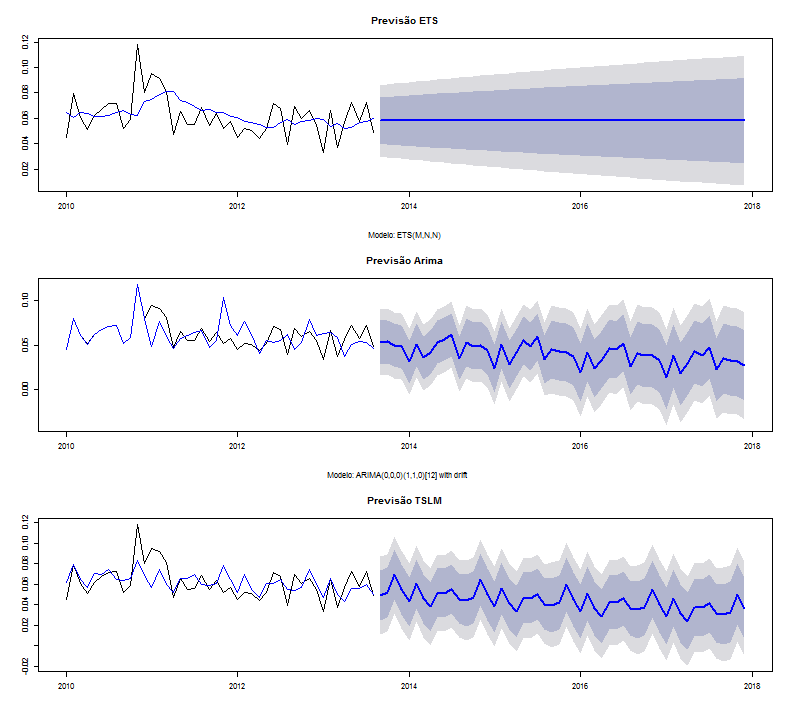 


### Erros
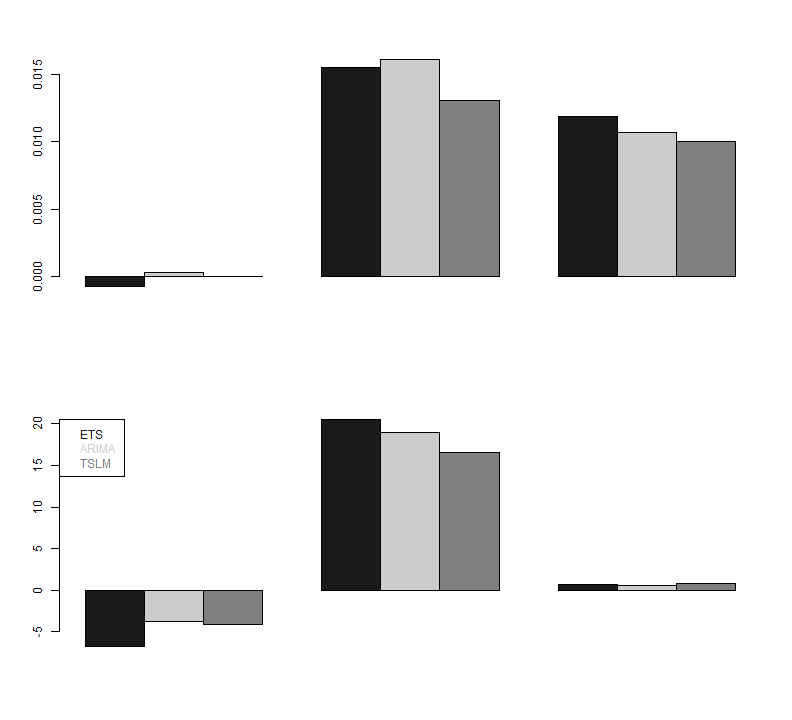 


###  Residuos ETS
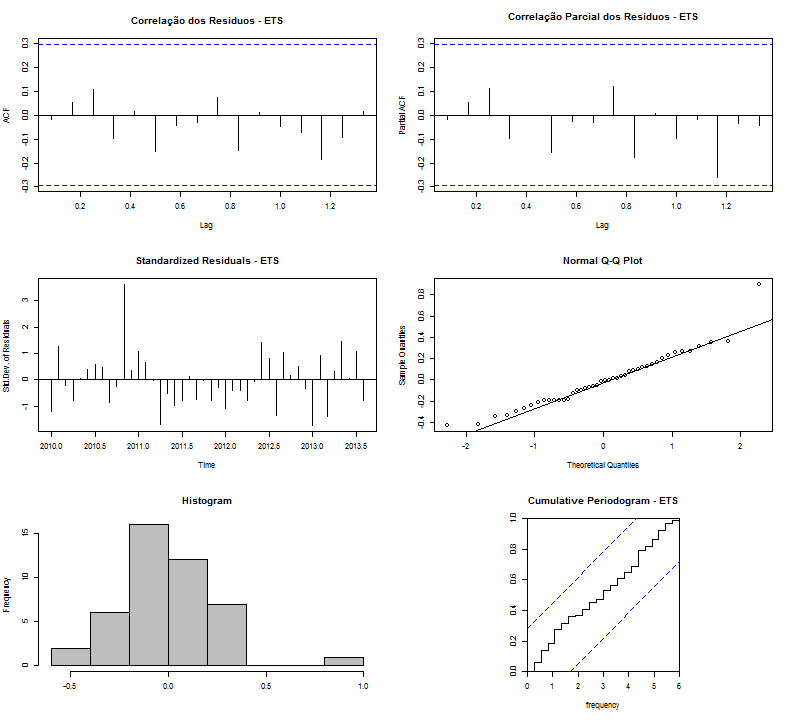 


###  Residuos ARIMA
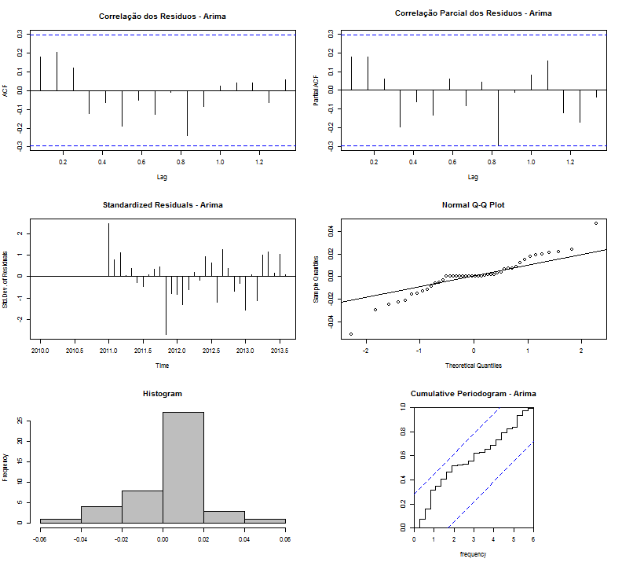 


###  Residuos TSLM
 

